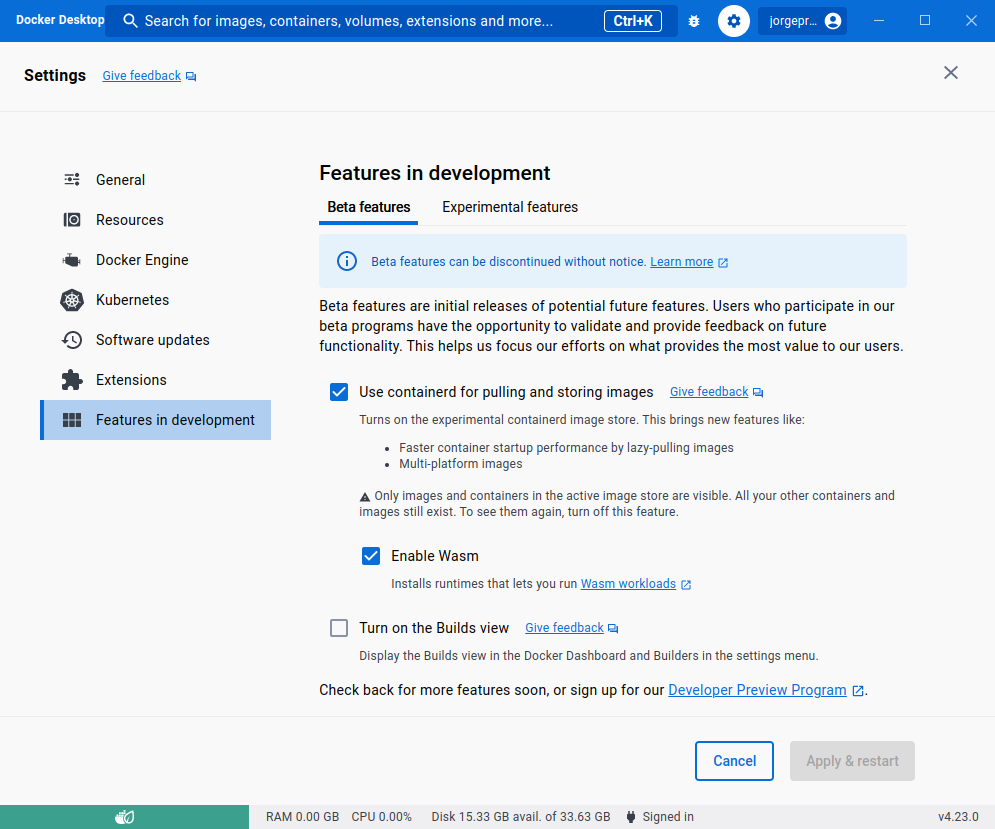

# Running Wasm Workers Server in Docker Desktop


## Introduction

In this article, we will introduce Wasm Workers Server and we will describe how it empowers developers. We will show you how you can swiftly start using Wasm Workers Server with Docker Desktop. You will understand what are the benefits of embracing this new technology, and you will be able to experiment with a few easy to run, practical examples.
All code for this article can be found on the [docker-wws-demo repo](https://github.com/ereslibre/docker-wws-demo).

### Wasm Workers Server

Wasm Workers Server (wws) is a tool that allows you to develop and run serverless applications using WebAssembly. You can write your applications in any of the currently supported languages: Rust, Go, JavaScript, Python, and Ruby.
Not only can you develop your application in the language of your choice: Wasm Workers Server is powered by the worker concept, and it is compatible with other serverless platforms, such as Cloudflare Workers, which means that you can focus on writing your application logic, easing the deployment phase of the application.

Along with the mentioned workers compatibility and capabilities, Wasm Workers Server also exposes rich platform features to your application such as Dynamic routing and a K/V store, among others.

### Docker + Wasm
Docker Desktop can run WebAssembly workloads since version 4.21.0, and supports wws since version 4.23.0.
As this is a beta feature, users need opt-in by enabling the option in the settings.
In Docker Desktop, open the settings and go to _Features in development_.
In the _Beta features_ section, check the _Use containerd for pulling and storing images_ option and click _Apply & restart_.
Once this is done you can check the _Enable Wasm_ option and again click _Apply & restart_.
This second time a confirmation popup will show, select _Install_.
And you are done!



You can now run WebAssembly workflows using Docker:
```shell-session
$ docker run --rm \
  --platform=wasm32/wasi \
  --runtime=io.containerd.wasmtime.v1 \
  rumpl/hello-barcelona
Hola Barcelona!
My current OS is  wasm32
```

## Docker Desktop

### Containers and WebAssembly: a seamless integration

Back in October 2022, Docker published the technical preview of the Docker + Wasm Docker Desktop integration. As of today, it is a Beta feature in their current Docker Desktop offering.
This allows Docker Desktop users to seamlessly integrate both containers and WebAssembly modules together.

### WebAssembly runtimes

Docker Desktop packages multiple WebAssembly runtimes that allow different features depending on your needs and priorities. As of today, it features the following WebAssembly runtimes —in alphabetical order—:
* lunatic
* spin
* slight
* wasm-workers-server
* wasmedge
* wasmtime

Different runtimes might be more specialized or performant for some specific tasks or might have different features when it comes to running your WebAssembly modules.
As an example, `wasmtime` is one of the Bytecode Alliance WebAssembly runtimes, whereas `wasm-workers-server` embeds `wasmtime` internally, adding specific functionality on top of it. Depending on your needs, goals or requirements, a specific runtime might suit better than others for that task.

## Docker Desktop + Wasm Workers Server

As we have seen, one of the runtimes that Docker Desktop provides for running WebAssembly is Wasm Workers Server.

In the next sections, we are going to show how easy it is to write serverless functions in different languages, and how you can run them on top of Docker Desktop.

### Features

Wasm Workers Server [supports multiple languages](https://workers.wasmlabs.dev/docs/languages/introduction), as of today, they are the following:
- [Go](https://workers.wasmlabs.dev/docs/languages/go)
- [JavaScript](https://workers.wasmlabs.dev/docs/languages/javascript)
- [Python](https://workers.wasmlabs.dev/docs/languages/python)
- [Ruby](https://workers.wasmlabs.dev/docs/languages/ruby)
- [Rust](https://workers.wasmlabs.dev/docs/languages/rust)

You can mix and match your functions in the language of your choice. We have provided a Software Development Kit (SDK) for each one of them, so that you only have to focus on writing your serverless logic. These SDK's are idiomatic for the language they are targeting, and they allow you to take advantage of advanced Wasm Workers Server features, such as K/V stores and performing HTTP requests to the outer world of the WebAssembly sandbox in a capability-based model.
You can find a detailed description of all the features [in the Wasm Workers server documentation](https://workers.wasmlabs.dev/docs/features/all).

### Language walkthroughs

In this section, you will write a simple program for each language, so that you can get an idea of how easy it is to write and run your own serverless functions. While simple, this program will also illustrate how to use Wasm Workers Server exposed to your functions.
This program will perform an HTTP request to a remote server: `https://random-data-api.com/api/v2/users`. This service will provide to us a random user with multiple fields: first name, last name, username, email, password… We will perform a request to this service to generate a new user, but we will filter only to some fields of our interest. This shows how you can do transformations on such data, and then, the program will return the new user along with other information that is gathered from the SDK: it will read a file that is available to the WebAssembly sandbox, and will also increase a counter in a K/V store that outlives the current request. 
As described in the Wasm Workers Server documentation, the current feature support as of this article, is as follows:

| Language   | K/V Store | Environment Variables | Dynamic Routes | Folders | HTTP Requests |
|------------|-----------|-----------------------|----------------|---------|---------------|
| Go         | ✅        | ✅                    | ✅             | ✅      | ✅            |
| JavaScript | ✅        | ✅                    | ✅             | ❌      | ✅            |
| Python     | ✅        | ✅                    | ✅             | ✅      | ❌            |
| Ruby       | ✅        | ✅                    | ✅             | ✅      | ❌            |
| Rust       | ✅        | ✅                    | ✅             | ✅      | ✅            |

You can find the [current up-to-date feature support table here](https://workers.wasmlabs.dev/docs/features/all#language-compatibility).

#### Running the examples

If you have Docker Desktop version 4.23.0 or newer, you can run the examples in this article yourself. We have prepared a container image that you can use to follow along:

```shell-session
$ docker run -d \
  --name docker-wws \
  -p 3000:3000 \
  --runtime=io.containerd.wws.v1 \
  --platform=wasi/wasm \
  ereslibre/wws-demo:latest # <TODO>: republish at a better place</TODO>
```

Then using your browser navigate to http://localhost:3000/user-generation-rust to see it in action.

#### Compiled Languages

Many compiled languages support compiling your programs to WebAssembly. Specifically, to WebAssembly + WebAssembly System Interface (WASI).

##### Rust

The Rust ecosystem has great support for WebAssembly + WASI. All features are supported in the Rust SDK, as shown in the previous table.

```rust
use anyhow::{anyhow, Result};
use serde::{Deserialize, Serialize};
use std::fs::read_to_string;

use wasm_workers_rs::{
    bindings,
    http::{Request, Response},
    worker, Cache, Content,
};

#[derive(Deserialize, Serialize)]
struct User {
    first_name: String,
    last_name: String,
    username: String,
    email: String,
}

#[derive(Deserialize, Serialize)]
struct ResponseData {
    user: User,
    some_file_contents: String,
    generated_users: u32,
}

const GENERATED_USERS_COUNTER: &str = "generated_users_counter";

#[worker(cache)]
fn reply(_req: Request<String>, cache: &mut Cache) -> Result<Response<Content>> {
    let external_request = Request::builder()
        .uri("https://random-data-api.com/api/v2/users")
        .body(String::new())
        .map_err(|err| anyhow!("could not build request: {:?}", err))?;
    let response = bindings::send_http_request(external_request)
        .map_err(|err| anyhow!("could not fetch data from remote service: {:?}", err))?;
    let user: User = serde_json::from_slice(response.body())
        .map_err(|err| anyhow!("invalid data returned by remote service: {:?}", err))?;

    let generated_users_counter = match cache.get(GENERATED_USERS_COUNTER) {
        Some(counter) => counter.parse::<u32>().unwrap_or(0),
        None => 0,
    } + 1;

    cache.insert(GENERATED_USERS_COUNTER.to_string(), generated_users_counter.to_string());

    let response = ResponseData {
        user,
        some_file_contents: read_to_string("/tmp/file.txt")?,
        generated_users: generated_users_counter,
    };

    Ok(Response::builder()
        .status(200)
        .header("x-generated-by", "wasm-workers-server")
        .body(
            serde_json::to_string(&response)
                .map_err(|err| anyhow!("could not marshal result: {:?}", err))?
                .into(),
        )
        .map_err(|err| anyhow!("could not retrieve remote service result: {:?}", err))?)
}
```

Let's generate a random user with the Rust endpoint:

```shell-session
$ curl http://localhost:3000/user-generation-rust
{"user":{"first_name":"Cherly","last_name":"Medhurst","username":"cherly.medhurst","email":"cherly.medhurst@email.com"},"some_file_contents":"Some content\n","generated_users":1}
```

##### Go

Go has great support for WebAssembly + WASI thanks to the TinyGo compiler since its version v0.16.0 (27th Oct 2020). The official Go compiler supports WebAssembly + WASI since version 1.21 (8th August 2023).

```go
package main

import (
	"encoding/json"
	"io"
	"io/ioutil"
	"net/http"
	"strconv"

	"github.com/vmware-labs/wasm-workers-server/kits/go/worker"
)

type User struct {
	FirstName string `json:"first_name"`
	LastName  string `json:"last_name"`
	Username  string `json:"username"`
	Email     string `json:"email"`
}

type ResponseData struct {
	User             User   `json:"user"`
	SomeFileContents string `json:"some_file_contents"`
	GeneratedUsers   uint32 `json:"generated_users"`
}

func main() {
	worker.ServeFunc(func(w http.ResponseWriter, r *http.Request) {
		cache, _ := r.Context().Value(worker.CacheKey).(map[string]string)

		// Create the request
		req, err := http.NewRequest(http.MethodGet, "https://random-data-api.com/api/v2/users", nil)
		if err != nil {
			panic(err)
		}

		res, err := worker.SendHttpRequest(req)
		if err != nil {
			panic(err)
		}

		// Read the response
		resBody, err := io.ReadAll(res.Body)
		if err != nil {
			panic(err)
		}
		res.Body.Close()

		user := User{}
		err = json.Unmarshal([]byte(resBody), &user)
		if err != nil {
			panic(err)
		}

		fileContents_, err := ioutil.ReadFile("/tmp/file.txt")
		if err != nil {
			panic(err)
		}
		fileContents := string(fileContents_)

		generatedUserCount := uint32(0)
		if count, ok := cache["generated_users_counter"]; ok {
			n, _ := strconv.ParseUint(count, 10, 32)
			generatedUserCount = uint32(n)
		}

		responseData := ResponseData{
			User:             user,
			SomeFileContents: fileContents,
			GeneratedUsers:   generatedUserCount,
		}

		marshaledResponseData, err := json.Marshal(responseData)
		if err != nil {
			panic(err)
		}

		w.Header().Set("x-generated-by", "wasm-workers-server")
		w.Write([]byte(marshaledResponseData))
	})
}
```

Generate a random user:

```shell-session
$ curl http://localhost:3000/user-generation-go
{"user":{"first_name":"Dallas","last_name":"Jaskolski","username":"dallas.jaskolski","email":"dallas.jaskolski@email.com"},"some_file_contents":"Some content\n","generated_users":1}
```


##### Other compiled languages

Other languages such as C/C++ or [Zig](https://github.com/vmware-labs/wasm-workers-server/issues/144) might be be of interest to the community. Contributions are more than welcome, so if you want to add or would like to see your favourite language supported, feel free to open an issue, PR, or vote on existing ones.

We are also thrilled to see SDK's being improved to support all Wasm Workers Server features, in the most idiomatic way for the language that SDK targets. Feel free to [contribute them](https://github.com/vmware-labs/wasm-workers-server/issues?q=is%3Aopen+label%3A%22🚀+enhancement%22+label%3A%22🔨+sdks%22) if you feel like it!

#### Interpreted Languages

Currently, Wasm Workers Server supports JavaScript, Python and Ruby. When an interpreter is required to execute our functions, we have to instruct Wasm Workers Server where to find it, along with other information: such as what is the extensions it can handle, what is the entry point of our function, and what is the glue code that will be added to all our functions written in that language.
For this purpose, the `wws` binary provides the `runtimes` command. It allows you to manage runtimes that can handle functions written in interpreted languages.

```shell-session
$ wws runtimes list
⚙️  Fetching data from the repository...
┌────────┬───────────────────┬──────────────────────┬───────────┬─────────────┐
│ Name   │ Version           │ Tags                 │ Extension │ Binary      │
├────────┼───────────────────┼──────────────────────┼───────────┼─────────────┤
│ ruby   │ 3.2.0+20230215-1  │ latest, 3.2, 3.2.0   │ rb        │ ruby.wasm   │
├────────┼───────────────────┼──────────────────────┼───────────┼─────────────┤
│ python │ 3.11.1+20230217-1 │ latest, 3.11, 3.11.1 │ py        │ python.wasm │
├────────┼───────────────────┼──────────────────────┼───────────┼─────────────┤
│ ruby   │ 3.2.0+20230215    │ -                    │ rb        │ ruby.wasm   │
├────────┼───────────────────┼──────────────────────┼───────────┼─────────────┤
│ python │ 3.11.1+20230217   │ -                    │ py        │ python.wasm │
└────────┴───────────────────┴──────────────────────┴───────────┴─────────────┘
```

There are available interpreters for ruby and python. Each runtime defines what are the supported file extensions. Wasm Workers Server will use this information to execute your functions with the appropriate interpreter.
As you might have noticed, no JavaScript runtime is present on the previous listing, because Wasm Workers Server integrates the QuickJS interpreter as of now, so you don’t even need to download a JavaScript runtime specifically to write your functions in JavaScript. They will work out of the box.

### Configuration: `.wws.toml`
The `.wws.toml` configuration on the root of our project specifies Wasm Workers Server configuration common to the whole tree that will be served by wws. In our example, a possible configuration follows:

```toml
version = 1

[[repositories]]
name = "wasmlabs"
url = "https://workers.wasmlabs.dev/repository/v1/index.toml"

[[repositories.runtimes]]
name = "python"
version = "3.11.1+20230217-1"
tags = [
    "latest",
    "3.11",
    "3.11.1",
]
status = "active"
extensions = ["py"]
args = [
    "--",
    "/src/index.py",
]

[repositories.runtimes.binary]
url = "https://github.com/vmware-labs/webassembly-language-runtimes/releases/download/python%2F3.11.1%2B20230217-15dfbed/python-3.11.1.wasm"
filename = "python.wasm"

[repositories.runtimes.binary.checksum]
type = "sha256"
value = "66589b289f76bd716120f76f234e4dd663064ed5b6256c92d441d84e51d7585d"

[repositories.runtimes.polyfill]
url = "https://workers.wasmlabs.dev/repository/v1/files/python/3-1/poly.py"
filename = "poly.py"

[repositories.runtimes.polyfill.checksum]
type = "sha256"
value = "74d10132b0577a39e4ea30002d4605b7cdfb8f39abca327a45c8b313de7ea304"

[repositories.runtimes.wrapper]
url = "https://workers.wasmlabs.dev/repository/v1/files/python/3-1/wrapper.txt"
filename = "wrapper.txt"

[repositories.runtimes.wrapper.checksum]
type = "sha256"
value = "cf1edc5b1427180ec09d18f4d169580379f1b12001f30e330759f9a0f8745357"

[[repositories.runtimes]]
name = "ruby"
version = "3.2.0+20230215-1"
tags = [
    "latest",
    "3.2",
    "3.2.0",
]
status = "active"
extensions = ["rb"]
args = [
    "--",
    "/src/index.rb",
]

[repositories.runtimes.binary]
url = "https://github.com/vmware-labs/webassembly-language-runtimes/releases/download/ruby%2F3.2.0%2B20230215-1349da9/ruby-3.2.0.wasm"
filename = "ruby.wasm"

[repositories.runtimes.binary.checksum]
type = "sha256"
value = "abe348fba157a756f86194be445c77c99e8ed64ca76495ea07ed984f09eb66ae"

[repositories.runtimes.polyfill]
url = "https://workers.wasmlabs.dev/repository/v1/files/ruby/3-1/poly.rb"
filename = "poly.rb"

[repositories.runtimes.polyfill.checksum]
type = "sha256"
value = "449855a5d315879ab0ad830aa6a3f689e68fed4490617ea03efc77c9da64f630"

[repositories.runtimes.wrapper]
url = "https://workers.wasmlabs.dev/repository/v1/files/ruby/3-1/wrapper.txt"
filename = "wrapper.txt"

[repositories.runtimes.wrapper.checksum]
type = "sha256"
value = "6d808b4747cf30f82665a38a47e1176513bbdd6ad558c09db03d719e33ad2da0"
```

This file was generated by running `wws runtimes install ruby latest` and `wws runtimes install python latest`. This generates the `.wws.toml` file on the directory where it was executed, as well as creating a `.wws` directory that contains the runtimes that were downloaded. These are the runtimes that Wasm Workers Server will instantiate when files with matching extensions are found in the filesystem.

##### JavaScript

The JavaScript Kit is very complete except for the filesystem access. The source code of our function looks like this:

```js
const setCache = (key, data) => Cache.set(key, data);
const getCache = key => Cache.get(key);

const reply = async (request) => {
  try {
    let res = await fetch("https://random-data-api.com/api/v2/users");
    let res_json = await res.json();

    let generated_users_counter = getCache("generated_users_counter");
    if (!generated_users_counter) {
      generated_users_counter = 1;
    } else {
      generated_users_counter = parseInt(generated_users_counter, 10) + 1;
    }
    setCache("generated_users_counter", generated_users_counter.toString());

    return new Response(
      JSON.stringify({
        "user": {
          "first_name": res_json.first_name,
          "last_name": res_json.last_name,
          "username": res_json.username,
          "email": res_json.email
        },
        "generated_users": generated_users_counter
      }),
      {
        "headers": {
          "x-generated-by": "wasm-workers-server"
        }
      }
    );
  } catch (e) {
    return new Response(JSON.stringify({ "error": e.toString() }), { "status": 500 });
  }
}

// Subscribe to the Fetch event
addEventListener("fetch", event => {
  return event.respondWith(reply(event.request));
});
```

As you can see, we are able to filter down the attributes we are interested in, and we can perform operations on the K/V store. However, in the JS case we cannot access files in the filesystem.
```shell-session
$ curl http://localhost:3000/user-generation-js
{"user":{"first_name":"Eli","last_name":"Stark","username":"eli.stark","email":"eli.stark@email.com"},"generated_users":2}
```

##### Python

Given that the Python Kit does not support all the features we have shown in the previous languages, we will mock the answer from the HTTP service, and will not use the K/V store as in our previous examples. However, we can read files made available in the filesystem and show its contents, as we have done for Rust and Go.

```python
import json
from collections import namedtuple

class User:
    def __init__(self, first_name, last_name, username, email):
        self.first_name, self.last_name, self.username, self.email = first_name, last_name, username, email

    @staticmethod
    def from_json(dict):
      return User(dict['first_name'],
                  dict['last_name'],
                  dict['username'],
                  dict['email'])

def worker(request):
    sample_json = """{
      "first_name": "Tracie",
      "last_name": "Schroeder",
      "username": "tracie.schroeder",
      "email": "tracie.schroeder@email.com",
      "password": "secret"
    }"""
    user = json.loads(sample_json, object_hook=User.from_json)
    return Response(
        json.dumps({
            "user": user.__dict__,
            "some_file_contents": open("/tmp/file.txt").read(),
        }, separators=(',', ':'))
    )
```

```shell-session
$ curl http://localhost:3000/user-generation-python
{"user":{"first_name":"Tracie","last_name":"Schroeder","username":"tracie.schroeder","email":"tracie.schroeder@email.com"},"some_file_contents":"Some content\n"
```

##### Ruby

Similar to the Python case, the Ruby Kit does not support all the Wasm Workers Server features as of today. We can mock the answer from the HTTP service, and skip the part of accessing the K/V store as in the Python case. As happened with the Python example, we can read files from the filesystem that were preopened and made available to the WASI sandbox.

```ruby
require 'json'

def allowed_attributes
  [:first_name, :last_name, :username, :email]
end

def worker(req)
  sampleJson = <<-JSON
    {
      "first_name": "Tracie",
      "last_name": "Schroeder",
      "username": "tracie.schroeder",
      "email": "tracie.schroeder@email.com",
      "password": "secret"
    }
  JSON

  user = JSON.parse sampleJson, symbolize_names: true

  user_response = Hash.new
  allowed_attributes.each do |attribute|
    user_response[attribute] = user[attribute]
  end

  res = Response.new({
    "user": user_response,
    "some_file_contents": File.read("/tmp/file.txt")
  }.to_json)
  res.headers["x-generated-by"] = "wasm-workers-server"
  res
end
```
Make a request:

```shell-session
$ curl http://localhost:3000/user-generation-ruby
{"user":{"first_name":"Tracie","last_name":"Schroeder","username":"tracie.schroeder","email":"tracie.schroeder@email.com"},"some_file_contents":"Some content\n"}
```

### Developers, developers, developers

One of the greatest things about the Docker + Wasm integration is that from the developer point of view things are very familiar. Creating the image that contains all the examples that you have executed is as simple as:

```Dockerfile
FROM scratch
COPY ./apps/root .
ENTRYPOINT ["."]
```

Building our image with the previous `Dockerfile` boils down to:

```shell-session
$ docker buildx build --platform wasi/wasm --provenance false -t wws-apps:latest .
```
We can then operate our `wws-apps:latest` image as we would a regular container image. The major difference in terms of the image metadata is the following:

```shell-session
$ docker inspect wws-apps:latest -f '{{.Architecture}}'
wasm

$ docker inspect wws-apps:latest -f '{{.Os}}'
wasi
```

For the rest, the container image is a regular one. In this case, the scratch image will contain all our functions, although we could have split that in multiple Docker images as well.
Although our functions run in a WebAssembly sandbox, there are very useful features that are enabled in Docker + Wasm. For example, you can mount a file from your local filesystem, and it will be made visible to your functions. Assuming you have instructed Wasm Workers server on your function that you want to map a path from the WebAssembly host to your WebAssembly module:

```toml
name = "user-generation-rust"
version = "1"

[[folders]]
from = "./tmp"
to = "/tmp"
```

And that you also instruct Docker Desktop to run your module with volume mounting, like `docker run -v some-local-path:$(pwd)/tmp`, this folder will be made available to the WebAssembly guest, where modules built for `wasm32-wasi` will be able to use the system interface to read or write content in the exposed filesystem.

## Conclusion

<TODO>